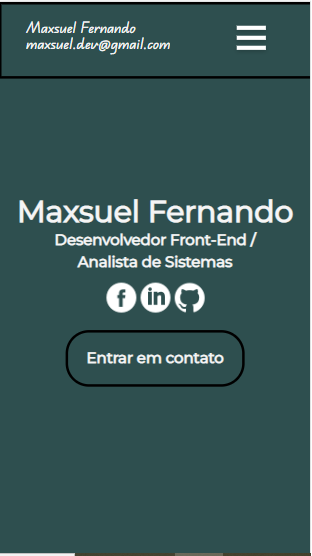
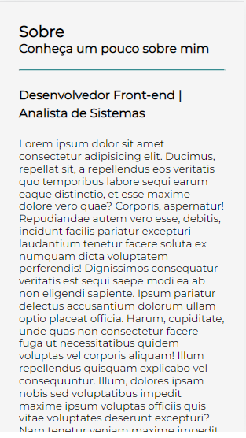

# portfolio2.0


## Sobre o projeto
Meu portfólio com o CSS sendo refatorado para Mobile First e elementos com Flexbox.

<br>

### Layout Mobile First




<br>

## Tecnologias utilizadas

### Front-End
* HTML / CSS / JS

<br>

## Como executar o projeto
```bash
# clonar repositório
git clone git@github.com:maxsueldev/portfolio2.0.git

# entrar na pasta do projeto e abrir o arquivo index.html
```

<br>

## Autor
Maxsuel Santos

<https://www.linkedin.com/in/maxsuelfernandob/>

